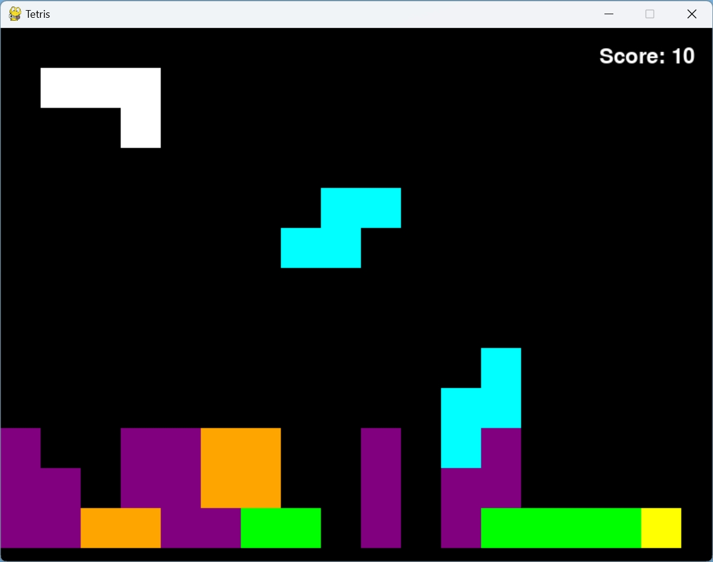

# Tetris

## tetris.py

### Eine fesselnde Reise in die Welt der Blockanordnung

Begib dich auf eine aufregende Reise der strategischen Blockmanipulation mit Tetris! Nutze deine Fertigkeiten, um die herabfallenden Blöcke mithilfe der linken und rechten Cursortasten zu manövrieren und sie mühelos in die gewünschten Positionen zu lenken. Wenn es eilt, beschleunige den Abstieg der Blöcke, indem du die Abwärtstaste drückst.

Entfalte deine Kreativität, während du Blöcke mit der Leertaste drehst, um sie passgenau in die freien Räume zu platzieren. Für diejenigen, die einen Blick auf die bevorstehende Herausforderung werfen möchten, kann der geheimnisvolle nächste Block durch einfaches Drücken der **V**-Taste enthüllt oder verborgen werden.

Bereite dich darauf vor, von der faszinierenden Welt von Tetris gefesselt zu werden, während du deine strategischen Fähigkeiten einsetzt, um die sich ständig verändernde Landschaft der fallenden Blöcke zu meistern. Wirst du der Herausforderung gewachsen sein und die Vollendung der Blockplatzierung erreichen? Die Bühne ist bereit und die Blöcke warten auf deine fachkundige Anleitung. Lass das Tetris-Abenteuer beginnen!